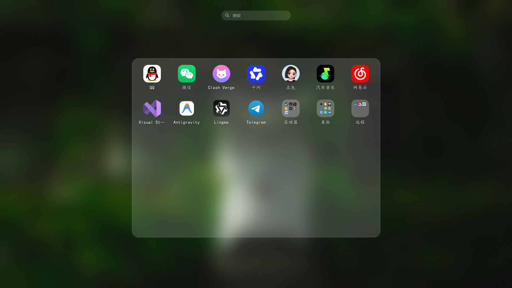

<p align="center">
  
</p>

<p align="center">
  <b>English</b> | <a href="README_ZH.md">简体中文</a>
</p>

<p align="center">
  <a href="https://www.python.org/"></a>
  <a href="https://www.microsoft.com/windows"></a>
  <a href="LICENSE"></a>
</p>

<h1 align="center">Cwin-MacLaunchpad</h1>

<p align="center">
  
</p>

Hello! I really love macOS's Launchpad, but I couldn't find a decent alternative for Windows, so I tried writing my own.

I'm hoping some experienced developers can guide me. Please be gentle, guys!

---

## Core Playful Features

* Real DWM Glassmorphism: We bridged Windows' low-level DWM system calls using ctypes to apply native Aero Blur. It is not a fake screenshot; if a video is playing or a game is running behind the launcher, you will see it moving in real time through the frosted glass.
* Free-form Grid & Layout: You can arrange icons anywhere on the grid, just like on the Windows desktop, leaving blank spaces if you want. It supports wheel scrolls and arrow keys to slide between pages.
* Drag-and-Drop Folders: Dragging an icon over another automatically groups them into a folder. Dragging an icon out of the folder boundaries removes it. It's surprisingly satisfying to play with.
* Smooth Folder Transitions: Expanding a folder does not just fade in; the background blur radius smoothly transitions from 0 to 25 pixels in 0.25 seconds using QPropertyAnimation, giving it a realistic physical inertia.
* Minimalist In-place Rename: No ugly dialog boxes popping up. Right-click or double-click the text underneath the icon to edit, and click anywhere on the blank background to automatically save and exit editing.
* Fuzzy Pinyin Search: Integrated with a phonetic translation library. The search bar is hidden by default, but the moment you start typing, it pops up. Supports English, Chinese, Pinyin initials, and full Pinyin fuzzy matching.
* WYSIWYG Settings UI: A clean dual-pane control panel where you can drag sliders to adjust columns, rows, spacing, and icon sizes. The main grid redraws instantly as you drag. Supports auto-start registry injection and custom hotkey binds.
* Clean Background Process: We removed the tray icon in the system corner so it runs silently in the background like a system service. Toggle it using Ctrl + Space (customizable). To change settings or exit, just right-click any blank area on the Launchpad to summon the menu.

---

## Project Structure & Module Breakdown

The project structure is organized as follows:

```
MacLaunchpad/
├── core/                       # Core system logic and OS integration APIs
│   ├── __init__.py
│   ├── app_scanner.py          # Data controller: manages custom apps DB, folder logic, and launches processes
│   ├── config.py               # Settings persistence (config.json) and Auto-Start registry control
│   ├── hotkey_manager.py       # Win32 RegisterHotKey listener loop running in a background daemon thread
│   ├── icon_cache.py           # Multi-level memory/disk PNG cache wrapper to boost launch speeds
│   └── icon_extractor.py       # High-res icon extraction using Win32 API PrivateExtractIcons
├── data/                       # Local application database
│   └── apps_db.json            # JSON database storing scanned app locations and layout maps
├── docs/                       # Project specifications and requirements
├── ui/                         # PyQt5 Graphical User Interface components
│   ├── __init__.py
│   ├── animations.py           # Scale, fade, and slide transition manager using QPropertyAnimation
│   ├── app_grid.py             # Layout container managing paginated grids, drag reordering, and drop swaps
│   ├── app_icon.py             # Icon widget handling hover scaling, text editor overlays, and shake states
│   ├── blur_effect.py          # Low-level ctypes bridge targeting SetWindowCompositionAttribute
│   ├── folder_view.py          # Sliding modal displaying apps grouped within a folder
│   ├── launchpad_window.py     # Fullscreen transparent window coordinating inputs, search, and events
│   ├── page_indicator.py       # Dynamic navigation dots responding to page slide indices
│   ├── search_bar.py           # Sleek search bar supporting instant filtering and focus redirection
│   └── settings_window.py      # Dual-pane card settings control panel with toggle switches and sliders
├── main.py                     # Entry point (handles setup, DPI awareness, and single-instance mutex)
└── requirements.txt            # Python dependency requirements
```

---

## Detailed Component Analysis

### Core Modules (`core/`)

* **`app_scanner.py`**:
  Acts as the data controller. Rather than automatically indexing all system files (which harms performance), it utilizes a "curated model" where users drag and drop `.exe` or `.lnk` shortcuts to populate the Launchpad. It manages folder creation, drag-in/drag-out logic, database syncs, and calls `subprocess.Popen` or `os.startfile` to launch programs.
* **`config.py`**:
  Handles system preferences stored in `%APPDATA%/MacLaunchpad/config.json`. Manages default parameters (such as grid spacing, columns, animations) and wraps the Windows Registry (`winreg`) API to seamlessly enable/disable run-on-startup behavior.
* **`hotkey_manager.py`**:
  Implements global hotkeys by invoking Win32 user32 APIs. It runs a lightweight background loop calling `GetMessageW` to intercept hotkeys (like `Ctrl+Space`) globally, emitting a PyQt signal to toggle the window without blocking GUI rendering.
* **`icon_extractor.py`**:
  A Win32 bridge to extract high-resolution (up to 256x256) icons. It utilizes `PrivateExtractIconsW` for native clarity, fallbacking to `SHGetFileInfoW` or `QFileIconProvider` when necessary, converting raw Windows HICON handles to Qt `QPixmap`.
* **`icon_cache.py`**:
  Saves extracted icons into `%APPDATA%/MacLaunchpad/cache/icons/` as PNG files. It keeps track of file modification times (`mtime`) to verify cache validity, preventing disk read slowdowns on startup.

### User Interface Modules (`ui/`)

* **`launchpad_window.py`**:
  The main coordinator. Represents the full-screen container that intercepts Esc key overrides, scrolling inputs (to switch pages), window resizing coordinates, and mouse clicks on blank areas to automatically close.
* **`blur_effect.py`**:
  Configures window transparency. Bypasses the newer Windows 11 Acrylic APIs (which impose dark grey overlays) in favor of the lower-level `ACCENT_ENABLE_BLURBEHIND` status, maintaining maximum brightness and transparency.
* **`app_grid.py` & `app_icon.py`**:
  Handles coordinate logic. Maps layout indices dynamically to coordinate grids. Displays hover feedback and coordinates dragging sequences by grab-rendering icon snapshots, setting offsets properly to prevent drag-start jumps.
* **`folder_view.py`**:
  Handles expanding folder groups. Instead of filling the screen, it draws a centered macOS-style card box over a dynamic backdrop blur.
* **`settings_window.py`**:
  Builds the visual options window. Contains customized PyQt subclasses like `ToggleSwitch` (a sliding iOS-like switch) and modern sliders. Allows real-time tweaks to columns/rows, spacing, and shortcut binds.

---

## Setup & Installation

### Prerequisites

Ensure you have **Python 3.8 or higher** installed.

### Install Dependencies

Install the required Win32 bindings and UI libraries:

```bash
pip install -r requirements.txt
```

*Requirements details:*

* `PyQt5` (Core UI framework)
* `pywin32` (Windows API wrappers)
* `Pillow` (Image processing)
* `pypinyin` (Chinese Pinyin sorting/search indexing)
* `keyboard` (Global input events)

### Run the Application

Execute the main entry script to start MacLaunchpad:

```bash
python main.py
```

*Note: The application uses a Win32 system mutex to enforce a single running instance. If the program is already active, launching it again will exit silently.*

---

## How to Use

* **Open/Close**: Press the global hotkey `Ctrl + Space` (customizable) to toggle the Launchpad. You can also press `Esc` or click on any empty background area to close it.
* **Rearrange Icons**: Click and drag an icon. Drop it on another icon to **create a folder**, drop it into a blank cell to **move/reposition**, or drop it inside an open folder to group it.
* **Remove / Rename Apps**: Right-click any icon to bring up the context menu. You can choose to rename it (editing text in-place) or delete it from the Launchpad database.
* **Add New Apps**: Drag and drop any executable (`.exe`) or shortcut (`.lnk`) from Windows File Explorer directly onto the active Launchpad screen to register it.
* **Configure Options**: Right-click on any empty background area of the Launchpad and select **Settings...** to open the customization control panel.
* **Quit**: Right-click on any empty background area and select **Quit Launchpad** to terminate the background daemon.

---

## License

This project is open-source and licensed under the **Apache License 2.0**. Feel free to use, modify, and distribute it. If you make modifications, please include prominent notices stating that you changed the files, and retain the original copyright and disclaimer notices.
